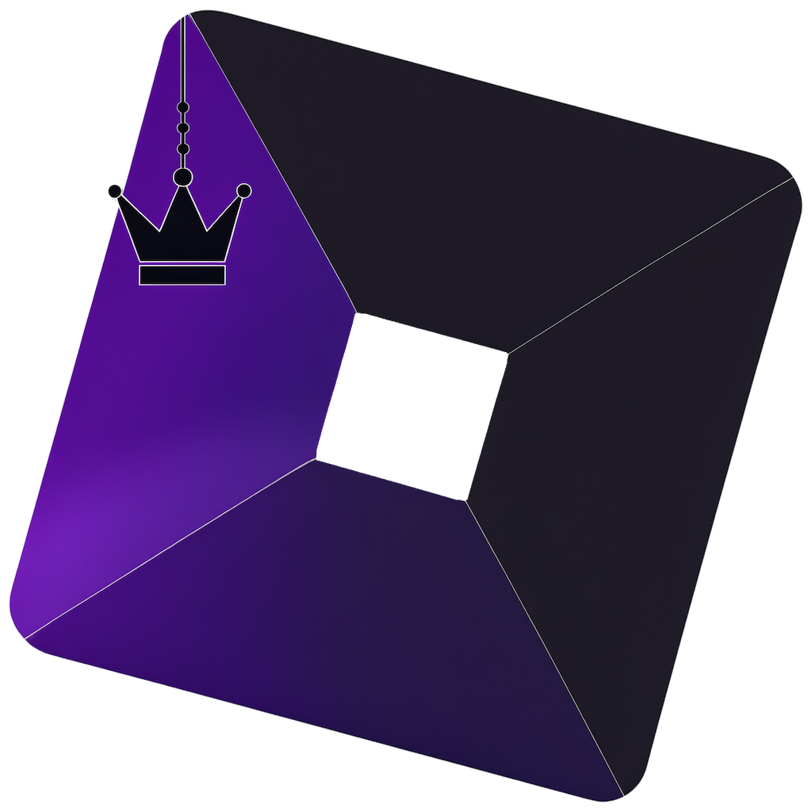

<div align="center">



# Nulltrap

**Альтернативный бутстраппер Roblox для Windows.**
Лёгкий, проверяемый и честный в том, что умеет и чего не умеет.

[English](README.md) · **Русский**



</div>

> [!WARNING]
> **Nulltrap работает, но релиза ещё не было.**
> Он устанавливает себя, скачивает Roblox и Studio и запускает их по кнопке
> «Играть» на сайте Roblox. Моды, отслеживание сессии и статус в Discord пока
> не сделаны. До первого релиза собирайте из исходников.
> См. [Статус](#статус).

> [!IMPORTANT]
> Когда появятся релизы, качать их можно будет только из этого репозитория.
> Сайты, предлагающие «Nulltrap» где-то ещё, к нам отношения не имеют. Это
> предупреждение стоит здесь с первого дня, потому что каждому проекту в этой
> нише приходилось добавлять его задним числом — после того, как появлялись
> поддельные сайты с загрузками.

## Зачем ещё один

Их уже несколько: [Bloxstrap] — оригинал, а также [Fishstrap], [Froststrap] и
[Voidstrap]. Это хорошие проекты, и Nulltrap им обязан (см.
[THIRD-PARTY-NOTICES.md](THIRD-PARTY-NOTICES.md)). Nulltrap существует ради
четырёх вещей, которых у них сейчас нет.

**Оставаться лёгким.** Бутстраппер скачивает архив, распаковывает его и
запускает процесс. Ему не нужен ни рантайм машинного обучения, ни встроенный
браузер. Список зависимостей короткий намеренно, а размер сборки — это число,
которое проверяет CI, а не то, которое незаметно растёт.

**Быть проверяемым.** Подписанные релизы, воспроизводимые сборки,
опубликованные хеши. Самая большая нерешённая проблема в этой нише в том, что
пользователь не может отличить настоящую загрузку от вредоносной, и технически
её пока не решает никто.

**Всерьёз относиться к модам.** После того как в сентябре 2025 года Roblox ввёл
[белый список FastFlags][FastFlag allowlist], произвольные флаги больше не
применяются — клиент игнорирует всё, чего нет в списке Roblox. Остались моды и
профили под конкретные игры, и они заслуживают большего, чем роль довеска.

**Быть расширяемым.** Настоящий контракт для плагинов, изданный отдельным
пакетом, чтобы расширения не зависели от внутренностей Nulltrap.

## Чего Nulltrap не делает

Nulltrap не внедряется в процесс клиента Roblox, не изменяет и не читает его
память. Не обходит античит. Не пытается обойти белый список FastFlags — Roblox
прямо предупредил, что правка флагов в памяти влечёт последствия, и это не та
черта, которую стоит переходить ради настройки графики.

Редактор FastFlags сверяется с белым списком и прямо говорит, когда флаг будет
проигнорирован, вместо того чтобы позволять думать, будто он применился.

## Статус

| Фаза | Содержание | Состояние |
| --- | --- | --- |
| 0 | Структура решения, защита архитектуры, CI | Готово |
| 1 | Развёртывание, загрузка пакетов, обработчики протоколов, установка, запуск | Готово |
| 2 | Моды, отслеживание сессии, статус в Discord | В работе |
| 3 | Профили по играм, подписанные релизы, SDK плагинов | Запланировано |
| 4 | Вторая платформа, если фундамент выдержит | Открыто |

Уже работает: установка без прав администратора, загрузка Roblox и Studio с
кешем по контрольной сумме, обработчики протоколов, настройки графики из тех,
что Roblox ещё разрешает, и интерфейс на русском и английском.

## Сборка

Требуется [.NET 10 SDK](https://dotnet.microsoft.com/download). Точная версия
закреплена в `global.json`.

```bash
dotnet build Nulltrap.slnx -c Release
```

Пересобрать иконку приложения из исходного рисунка (нужен Python с Pillow):

```bash
python scripts/make-icon.py
```

## Архитектура

```
src/
  Nulltrap.Core                    портируемый — развёртывание, пакеты, моды, флаги
  Nulltrap.Platform.Abstractions   портируемый — что ядру нужно от ОС
  Nulltrap.Platform.Windows        windows     — реестр, мьютексы, ярлыки
  Nulltrap.Plugins.Sdk             портируемый — публичный контракт плагинов
  Nulltrap.App                     windows     — оболочка на WPF
```

Всё держится на одном правиле: **`Nulltrap.Core` собирается под `net10.0` и
никогда под `net10.0-windows`.** Каждый существующий бутстраппер — это один
Windows-проект, и именно поэтому ни один из них так и не выпустил
кроссплатформенную поддержку, которую обещает: к моменту, когда за это берутся,
Windows-предположения уже повсюду.

Правило соблюдает сборка, а не дисциплина: CI компилирует `Core` и всё, что под
ним, на Linux, где зависимость от Windows просто не разрешается. Потянешься за
реестром из портируемой половины — сборка краснеет на том же пуше.

## Лицензия

[MIT](LICENSE). Nulltrap — неофициальный проект, не связанный с Roblox
Corporation и не одобренный ею.

[Bloxstrap]: https://github.com/bloxstraplabs/bloxstrap
[Fishstrap]: https://github.com/fishstrap/fishstrap
[Froststrap]: https://github.com/Froststrap/Froststrap
[Voidstrap]: https://github.com/KloBraticc/Voidstrap
[FastFlag allowlist]: https://devforum.roblox.com/t/allowlist-for-local-client-configuration-via-fast-flags/3966569
